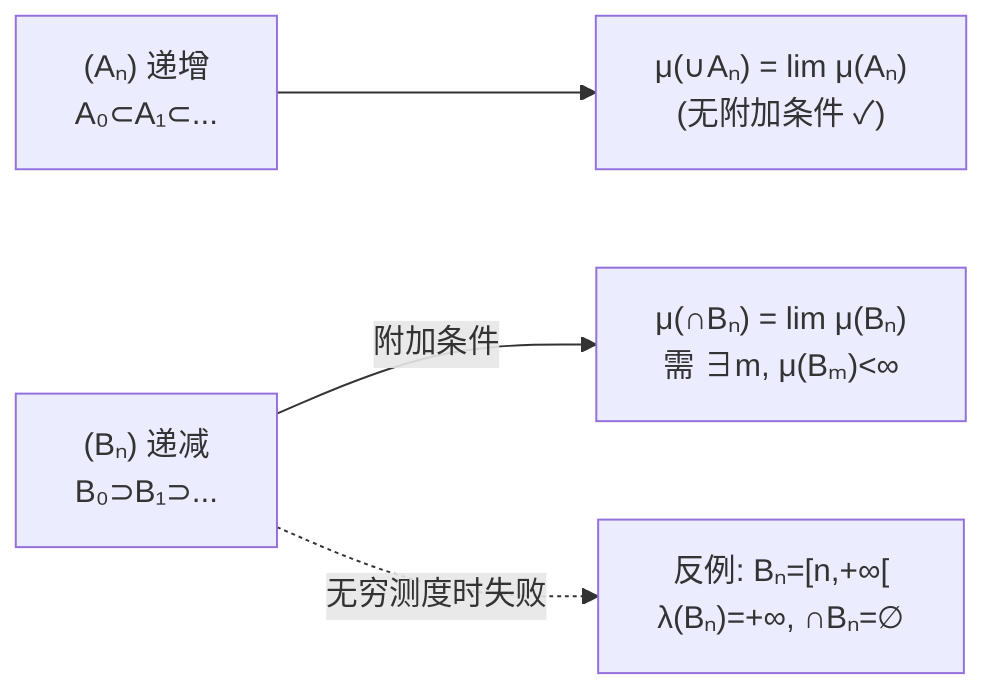

# 第一章 — Éléments de théorie de la mesure

*Cadre :* $(\Omega,\mathcal{T})$ 可测空间，$\mu$ 测度。本章建立测度论语言：可数集 / Tribu / Mesure / Borel-Cantelli。

## 全局概念地图 Carte des concepts {#sec-map}

下图贯穿三章的核心概念。可缩放平移，**点击节点**跳转到对应小节，**悬停**查看定义。

<ConceptMap />

## 1.1 Rappels théorie des ensembles {#sec-1-1}

::: def Déf 1.1.1 — Ensemble dénombrable 可数集
设 $E$ 为集合。若存在单射 $\varphi:E\to\mathbb{N}$，则称 $E$ 为**可数集**。
- 若 $\varphi$ 为双射，则 $E$ 为**无限可数集**（infini dénombrable）；否则为**有限集**（fini）。
- $\mathbb{Z},\mathbb{Q},\mathbb{N}\times\mathbb{N}$ 可数；$\mathcal{P}(\mathbb{N}),\mathbb{R}$ **不可数**。
:::

::: def Déf 1.1.2 — Induction structurelle 结构归纳法
$A\subset E$ 由以下两条给出：(i) 一个生成部分 $B\subset A$；(ii) 对有限或可数集 $I$ 的构造规则 $f:A^I\to E$，若 $(x_i)_{i\in I}$ 均属 $A$ 则 $f((x_i)_{i\in I})\in A$。$A$ 是满足这两条的**最小**子集。
:::

::: def Déf 1.1.3 — Définition récursive d'une fonction 函数的递归定义
$g:E\to F$：在生成集 $B$ 上 $g$ 已知；存在 $U:F^I\to F$ 使
$$g\big(f((x_i)_{i\in I})\big)=U\big((g(x_i))_{i\in I}\big).$$
:::

::: exer Exemples 例
- $\mathbb{N}$：$0\in\mathbb{N}$；$n\in\mathbb{N}\Rightarrow n+1\in\mathbb{N}$。
- $K[X]$：$\lambda,X$ 是多项式；$P+Q,\,P\cdot Q$ 仍是。
- Liste：$[\,]$ 是列表；$a::s$ 仍是 → 递归定义 $\mathrm{somme}$。
:::

## 1.2 Limite supérieure / inférieure d'une suite d'ensembles {#sec-1-2}

设 $(\Omega,\mathcal{T})$ 为一空间，$(A_n)_{n\in\mathbb{N}}$ 是 $\Omega$ 中集合序列。

::: def Déf 1.1.4 — Limite supérieure 上极限（无限多次）
$$\limsup_{n} A_n=\bigcap_{n\in\mathbb{N}}\bigcup_{m\ge n}A_m$$
$\omega\in\limsup A_n$ 意味着 $\omega$ 属于**无穷多个** $A_n$：对任意 $n$，总存在 $m\ge n$ 使 $\omega\in A_m$。
:::

::: def Déf 1.1.4 — Limite inférieure 下极限（最终一直在）
$$\liminf_{n} A_n=\bigcup_{n\in\mathbb{N}}\bigcap_{m\ge n}A_m$$
$\omega\in\liminf A_n$ 意味着 $\omega$ 从某项起**一直**出现在后续所有 $A_m$ 中。
:::

::: prop Prop 1.1.1 — 关系
$\liminf A_n\subset\limsup A_n$；若两者相等则称序列 $(A_n)$ **收敛**。
:::

交互演示：拖动起始项 $n$，观察哪些元素出现于**无限多个** $A_n$（limsup），哪些**从第 $n$ 项起一直**出现（liminf 由尾部交收敛得到）。

<LimsupLiminf />

::: attn Note — 概率解读（抛硬币）
设 $A_i=$「第 $i$ 次投掷为正面」：
- $\limsup A_n$ = 「出现**无限**多次正面」；
- $\liminf A_n$ = 「从某次起一直正面」。
:::

::: exer Exercice 1.1.1 — De Morgan
$\overline{\limsup A_n}=\liminf \overline{A_n}$，$\quad\overline{\liminf A_n}=\limsup \overline{A_n}$。
:::

## 1.3 Tribus（$\sigma$-algèbre）{#sec-1-3}

::: def Déf 1.2.1 — Tribu σ-代数
$\mathcal{T}\subset\mathcal{P}(\Omega)$ 满足：
- $\emptyset,\Omega\in\mathcal{T}$；
- $A\in\mathcal{T}\Rightarrow A^c\in\mathcal{T}$（对补集封闭）；
- $(A_n)\in\mathcal{T}^{\mathbb{N}}\Rightarrow\bigcup_n A_n\in\mathcal{T}$（对可数并封闭）。
:::

::: prop Prop 1.2.2–4 — Stabilités dérivées 派生封闭性
- 真差：$A\subset B\Rightarrow B\setminus A=B\cap A^c\in\mathcal{T}$；
- 可数交：$\bigcap_n A_n\in\mathcal{T}$；
- 极限：$\limsup A_n,\;\liminf A_n\in\mathcal{T}$。
:::

::: def Déf 1.2.2 — Tribu engendrée 生成的 σ-代数
包含 $\mathcal{S}$ 的**最小** $\sigma$-代数，记 $\sigma(\mathcal{S})=\bigcap\{\mathcal{T}\text{ tribu}:\mathcal{S}\subset\mathcal{T}\}$。
:::

::: def Déf 1.2.3 — Tribu borélienne 博雷尔 σ-代数
拓扑空间 $(E,\mathcal{O})$ 上由所有**开集**生成的 $\sigma$-代数 $\mathcal{B}(E)=\sigma(\mathcal{O})$，其元素称 **borélien**（Borel 集）。
:::

::: exer Exemple 1.2.1–3
- 最小 tribu：$\{\emptyset,\Omega\}$；$\mathcal{P}(\Omega)$ 总是 tribu。
- $\{A\subset\mathbb{R}:A\text{ 或 }A^c\text{ 可数}\}$ 是 tribu。
- 单点 $\{a\}=\bigcap_n\left(a-2^{-n},a+2^{-n}\right)$ 是 borélien，故 $\mathbb{Q},\mathbb{R}\setminus\mathbb{Q}$ 都是 borélien。
:::

::: attn Note — Système de Dynkin 与单调类定理
$\mathcal{D}$ 为 Dynkin 系：(i) $\Omega\in\mathcal{D}$；(ii) $A\subset B\Rightarrow B\setminus A\in\mathcal{D}$；(iii) 对不交可数并封闭。**单调类定理**：若 $\mathcal{G}$ 对有限交封闭，则 $\mathcal{D}(\mathcal{G})=\sigma(\mathcal{G})$ —— 证明唯一性的关键工具。
:::

## 1.4 Mesure {#sec-1-4}

::: def Déf 1.3.1 — Mesure 测度
$(\Omega,\mathcal{T})$ 可测空间。映射 $\mu:\mathcal{T}\to[0,+\infty]$ 称为**测度**，若：
- $\mu(\emptyset)=0$；
- **$\sigma$-可加性**：对两两不交的 $(A_n)$，$\displaystyle\mu\Big(\bigcup_{n}A_n\Big)=\sum_{n}\mu(A_n)$。
:::

::: def Déf 1.3.1 — Variantes 特殊测度
- **Finie 有限**：$\mu(\Omega)<+\infty$；
- **$\sigma$-finie**：$\Omega=\bigcup A_n$ 且 $\mu(A_n)<+\infty$；
- **Probabilité 概率**：$\mu(\Omega)=1$，此时 $(\Omega,\mathcal{T},\mathbb{P})$ 为概率空间；
- **Négligeable 零测集**：$\mu(A)=0$。
:::

::: theo Th 1.3.1 — Mesure de Lebesgue 勒贝格测度
在 $(\mathbb{R}^n,\mathcal{B}(\mathbb{R}^n))$ 上存在**唯一**测度 $\lambda$ 满足
$$\lambda\big([a_1,b_1]\times\cdots\times[a_n,b_n]\big)=\prod_{i=1}^n(b_i-a_i).$$
（存在性 admis；唯一性来自单调类定理。）
:::

::: prop Prop 1.3.1 — Propriétés élémentaires 基本性质
- 有限可加：$A\cap B=\emptyset\Rightarrow\mu(A\cup B)=\mu(A)+\mu(B)$；
- 单调性：$A\subset B\Rightarrow\mu(A)\le\mu(B)$，且 $\mu(A)<\infty$ 时 $\mu(B\setminus A)=\mu(B)-\mu(A)$；
- 容斥：$\mu(A\cup B)=\mu(A)+\mu(B)-\mu(A\cap B)$。
:::

::: prop Prop 1.3.2 — Continuité 测度的连续性
- $(A_n)$ **递增**：$\mu\big(\bigcup A_n\big)=\lim_n\mu(A_n)$（**无需附加假设**）；
- $(B_n)$ **递减**且 $\exists m,\ \mu(B_m)<+\infty$：$\mu\big(\bigcap B_n\big)=\lim_n\mu(B_n)$。
:::

交互演示：切换递增 / 递减 / 反例并播放，观察 $\mu(A_n)$ 是否收敛到目标集测度。

<MeasureContinuity />

::: prop Prop 1.3.3 — Sous-additivité (Boole) 次可加性
$\displaystyle\mu\Big(\bigcup_n A_n\Big)\le\sum_n\mu(A_n)$（**不需要不交**）。
:::

::: theo Prop 1.3.5 — Lemme de Borel-Cantelli 博雷尔-坎泰利引理
若 $\displaystyle\sum_n\mu(A_n)<+\infty$，则 $\mu\big(\limsup_n A_n\big)=0$。
（证：Boole 不等式 + 尾部 $\to 0$。）
:::

::: attn Attention — 递减连续的反例
递减连续**必须**有某项有限测度。反例：$B_n=[n,+\infty)$，$\lambda(B_n)=+\infty$，但 $\bigcap B_n=\emptyset$，$\lim\lambda(B_n)=+\infty\ne\lambda(\emptyset)=0$。
:::

## 关系图 Schémas {#sec-1-graph}

### 核心结构图 — Tribu / Mesure / 概率

```mermaid
flowchart TB
    SET["集合 Ω<br/>(Univers)"]
    TRIBU["Tribu 𝒯<br/>(σ-algèbre)"]
    MES["Espace mesurable<br/>(Ω, 𝒯)"]
    BOREL["Tribu borélienne 𝓑(E)<br/>由 ouverts 生成"]
    MESURE["Mesure μ<br/>(σ-additive, μ(∅)=0)"]
    FIN["μ finie<br/>μ(Ω) &lt; ∞"]
    PROBA["Probabilité ℙ<br/>μ(Ω) = 1"]
    LEB["Mesure de Lebesgue λ<br/>sur (ℝⁿ, 𝓑(ℝⁿ))"]
    BC["Borel-Cantelli<br/>Σμ(Aₙ)&lt;∞ ⇒ μ(limsup Aₙ)=0"]
    SET --> TRIBU
    TRIBU <-->|définition| MES
    TRIBU -->|E evn + ouverts| BOREL
    MES -->|+ μ| MESURE
    MESURE -->|μ(Ω) finie| FIN
    FIN -->|μ(Ω)=1| PROBA
    BOREL -->|Th 1.3.1 unicité| LEB
    MESURE --> BC
```

从集合到概率空间：Tribu 提供「可观测的」事件域；Mesure 给事件赋值；Probabilité 是 $\mu(\Omega)=1$ 的特例；Borel-Cantelli 把测度论与极限事件桥接。

### §1.4 测度的连续性 — 单调性条件对照



递增连续无条件成立；递减连续需要至少一项**有限**测度——这正是概率（有限测度）几乎总能用此性质的原因。
