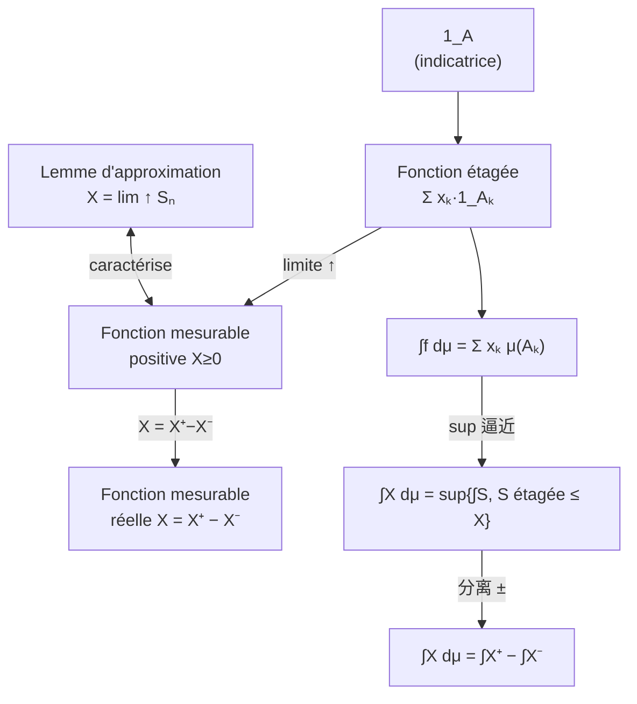
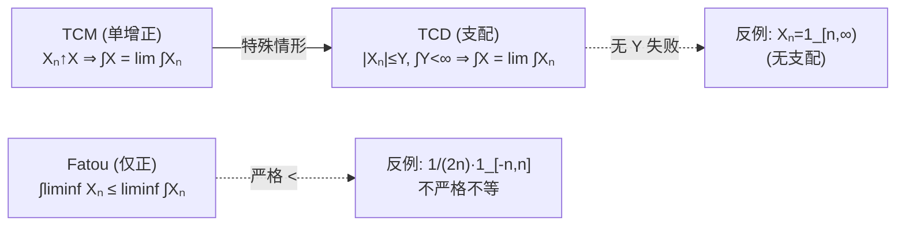

# 第二章 — Fonctions mesurables et intégration

*Cadre :* $(E,\mathcal{T})$、$(F,\mathcal{S})$ 可测空间，$f:E\to F$。建立**可测映射**与 **Lebesgue 积分**，并推广到任意测度空间。

| Français | 中文 | 概率对应 |
| :-- | :-- | :-- |
| Fonction mesurable | 可测函数 | Variable aléatoire 随机变量 |
| Intégration | 积分 | Espérance 期望 |
| Tribu | $\sigma$-代数 | 事件域 |
| Mesure | 测度 | 概率 |

## 2.1 Image réciproque（核心工具）{#sec-2-1}

::: prop Prop 2.1.1 — Propriétés algébriques 逆像的代数性质
设 $X:E\to F$。则
- $X^{-1}(\emptyset)=\emptyset$，$X^{-1}(F)=E$；
- $X^{-1}(B^c)=\big(X^{-1}(B)\big)^c$（补的逆像 = 逆像的补）；
- $X^{-1}\big(\bigcup_i B_i\big)=\bigcup_i X^{-1}(B_i)$，$\;X^{-1}\big(\bigcap_i B_i\big)=\bigcap_i X^{-1}(B_i)$；
- $B_i$ 两两不交 $\Rightarrow X^{-1}(B_i)$ 两两不交。

口诀：**逆像与一切集合运算交换**。
:::

::: prop Prop 2.1.2 — $X^{-1}(\mathcal{S})$ 是 $E$ 上的 tribu
$X^{-1}(\mathcal{S})=\{X^{-1}(B):B\in\mathcal{S}\}$ 是 $E$ 上的 $\sigma$-代数。
:::

::: prop Prop 2.1.3 — 到达域上的 tribu
给定 $(E,\mathcal{T})$ 与 $X:E\to F$，则 $\mathcal{S}=\{B\subset F:X^{-1}(B)\in\mathcal{T}\}$ 是 $F$ 上的 $\sigma$-代数。
:::

::: prop Prop 2.1.4 — 交换性（关键）
$$X^{-1}\big(\sigma(\mathcal{G})\big)=\sigma\big(X^{-1}(\mathcal{G})\big).$$
故只需在 $\mathcal{S}$ 的**生成系** $\mathcal{G}$ 上验证 $X^{-1}(G)\in\mathcal{T}$ 即可保证可测。
:::

交互演示：切换运算 $\cup/\cap/\setminus/{}^c$，验证 $X^{-1}(\text{运算})=\text{运算}(X^{-1})$ 恒成立（逆像与一切集合运算交换）。

<PreimageDemo />

## 2.2 Fonctions mesurables {#sec-2-2}

::: def Déf 2.2.1 — Fonction mesurable / Variable aléatoire
$f:(E,\mathcal{T})\to(F,\mathcal{S})$ **可测** $\iff \forall B\in\mathcal{S},\ f^{-1}(B)\in\mathcal{T}$。
- 概率空间上的可测函数称 **variable aléatoire**（随机变量）；
- $\mathcal{T},\mathcal{S}$ 均为博雷尔时称 **fonction borélienne**。
:::

::: def Déf 2.2.2 — Fonction simple / étagée 简单（阶梯）函数
存在两两不交的 $(A_k)_{1\le k\le n}\in\mathcal{T}^n$ 与 $(x_k)\in\mathbb{R}^n$，使
$$X=\sum_{k=1}^n x_k\,\mathbf{1}_{A_k}.$$
:::

::: def Déf 2.2.3–4 — $\overline{\mathbb{R}}$ 与运算
$\overline{\mathbb{R}}=\mathbb{R}\cup\{-\infty,+\infty\}$，$\;\mathcal{B}(\overline{\mathbb{R}})=\{A\subset\overline{\mathbb{R}}:A\cap\mathbb{R}\in\mathcal{B}(\mathbb{R})\}$。
- $x+(\pm\infty)=\pm\infty\ (x\in\mathbb{R})$；
- 约定 $0\cdot(\pm\infty)=0$（保持积分一致）；
- $\infty-\infty$ 未定义。
:::

::: prop Prop 2.2.1 — Composition 复合
$f,g$ 可测 $\Rightarrow g\circ f$ 可测。
:::

::: prop Prop 2.2.2 — 由生成系判可测（关键判定）
若 $\sigma(\mathcal{G})=\mathcal{S}$，则
$$f\text{ mesurable}\iff\forall G\in\mathcal{G},\ f^{-1}(G)\in\mathcal{T}.$$
典型取 $\mathcal{G}=\{(-\infty,a]:a\in\mathbb{R}\}$ 或开集族。
:::

::: prop Prop 2.2.3 — Stabilité par sup / inf / limsup / liminf
$(f_n)$ 可测族 $\Rightarrow \sup_n f_n,\ \inf_n f_n,\ \limsup_n f_n,\ \liminf_n f_n$ 均可测。
:::

::: prop Prop 2.2.4–7 — Exemples fondamentaux 基本例
- $\mathbf{1}_A$（$A\in\mathcal{T}$）可测；
- $f$ 连续（博雷尔）$\Rightarrow$ 可测；
- $X+Y,\,XY,\,\lambda X,\,|X|$ 可测（算术稳定性）；
- 向量值 $X=(X_1,\dots,X_n):E\to\mathbb{R}^n$ 可测 $\iff$ 每个分量 $X_i$ 可测。
:::

::: theo Prop 2.2.8–9 — Lemme d'approximation 逼近引理
$X:E\to[0,+\infty]$ 可测 $\iff$ 存在非负阶梯函数列 $(X_n)$ **逐点单增**趋于 $X$。构造：
$$X_n=\sum_{k=0}^{n2^n-1}\frac{k}{2^n}\,\mathbf{1}_{\{k/2^n\le X<(k+1)/2^n\}}+n\,\mathbf{1}_{\{X\ge n\}}.$$
:::

下面交互演示阶梯函数 $X_n$ 如何逐点单增逼近目标函数（拖动 $n$）：

<!-- StepApprox 组件 -->
<StepApprox />

::: attn Note — 概率视角
随机变量 $X:\Omega\to\mathbb{R}$，事件 $\{X\le a\}=X^{-1}\big((-\infty,a]\big)\in\mathcal{T}$，故可谈「$X$ 取这种值的概率」。
:::

## 2.3 Intégration de Lebesgue（四步构造）{#sec-2-3}

**构造路线：** (1) 阶梯正函数 → (2) 可测正函数（sup 逼近）→ (3) 实可测（$X^+-X^-$）→ (4) 在事件 $A$ 上限制（$\int_A=\int X\mathbf{1}_A$）。

::: def Déf 2.3.1 — ① Fonction étagée positive
$f=\sum_{k=1}^n x_k\mathbf{1}_{A_k}\ (x_k\ge 0)$：
$$\int f\,d\mu=\sum_{k=1}^n x_k\,\mu(A_k)\quad(\text{不依赖于划分}).$$
:::

::: def Déf 2.3.2 — ② Fonction mesurable positive
$X:\Omega\to[0,+\infty]$ 可测：
$$\int X\,d\mu=\sup\Big\{\int S\,d\mu:0\le S\le X,\ S\text{ étagée}\Big\}\in[0,+\infty].$$
若 $\int X\,d\mu<+\infty$ 称 $X$ 为 **$\mu$-intégrable**。
:::

::: def Déf 2.3.3 — ③ Fonction mesurable réelle
$X^+=\sup(X,0),\ X^-=\sup(-X,0)$ 均可测正。若 $\int X^+\,d\mu,\int X^-\,d\mu<+\infty$：
$$\int X\,d\mu=\int X^+\,d\mu-\int X^-\,d\mu.$$
$X$ intégrable $\iff |X|$ intégrable（因 $|X|=X^++X^-$）。
:::

::: def Déf 2.3.4 — ④ Intégrale sur $A\in\mathcal{T}$
$$\int_A X\,d\mu=\int X\cdot\mathbf{1}_A\,d\mu.$$
:::

::: def Déf 2.3.5 — Presque partout (p.p. / p.s.)
性质 $P$ 在 $\Omega$ 上 **$\mu$-p.p.** $\iff\exists A\in\mathcal{T},\ \mu(A)=0,\ \forall\omega\in A^c,\ P(\omega)$ 真。概率情形称 **presque sûr**。
:::

::: prop Prop 2.3.3–5 — Propriétés 性质（线性、单调、可积性）
$X,Y$ 正或可积：
- **线性**：$\int(X+Y)=\int X+\int Y$，$\int\lambda X=\lambda\int X$；
- **单调**：$X\le Y\Rightarrow\int X\le\int Y$；$X=Y$ p.p. $\Rightarrow$ 积分相等；
- $X$ 可积 $\iff|X|$ 可积；$X$ 可积 $\Rightarrow X$ p.p. 有限；
- $|X|\le Y$ 且 $Y$ 可积 $\Rightarrow X$ 可积；
- 不交 $A,B$：$\int_{A\cup B}=\int_A+\int_B$。
:::

::: exer Exercice 2.3.2 — Riemann ↔ Lebesgue
$f:[a,b]\to\mathbb{R}$ Riemann 可积 $\Rightarrow$ Lebesgue 可积，且 $\int_a^b f(t)\,dt=\int_{[a,b]}f\,d\lambda$。**反之不一定**：$\mathbf{1}_{\mathbb{Q}}$ 不 Riemann 可积，但 Lebesgue 可积且 $\int_{[a,b]}\mathbf{1}_{\mathbb{Q}}\,d\lambda=0$。
:::

::: exer Exercice 2.3.3 — 计数测度
$\mu(A)=\mathrm{Card}(A\cap\mathbb{N})$：$\int f\,d\mu=\sum_n f(n)$ —— **测度论积分 = 级数**。
:::

## 2.3′ Trois théorèmes de convergence（核心三定理）{#sec-2-3p}

::: theo Th 2.3.1 — Convergence monotone (TCM, Beppo-Levi)
$(X_n)$ 可测正、**逐点单增**趋于 $X$ $\Rightarrow X$ 可测且
$$\int X\,d\mu=\lim_{n\to\infty}\int X_n\,d\mu\quad(\text{允许}=+\infty).$$
**级数形式**：$Y_n\ge 0$ 可测 $\Rightarrow\int\sum_n Y_n\,d\mu=\sum_n\int Y_n\,d\mu$。
:::

::: theo Th 2.3.2 — Lemme de Fatou
$(X_n)$ 可测正：
$$\int\liminf_n X_n\,d\mu\le\liminf_n\int X_n\,d\mu.$$
**不等号可严格**：$X_n=\frac{1}{2n}\mathbf{1}_{[-n,n]}$，$\int X_n=1\to\int 0=0$。
:::

::: theo Th 2.3.3 — Convergence dominée (TCD, Lebesgue)
$(X_n)$ 可测，假设：$X_n\to X$ p.p.，且 $\exists Y\ge 0$ 使 $|X_n|\le Y$ 与 $\int Y\,d\mu<+\infty$（支配假设）。则 $X$ 可积且
$$\int X\,d\mu=\lim_n\int X_n\,d\mu,\qquad\lim_n\int|X_n-X|\,d\mu=0.$$
:::

::: attn Note — 三定理对比
- **TCM**：单增 + 正 → 等式；
- **Fatou**：仅正 → 不等式；
- **TCD**：可控（dominée）→ 等式（最常用）。

反例（支配不可省）：$f_n=\frac{1}{2n}\mathbf{1}_{[-n,n]}$ 一致趋 0，但 $\int f_n=1\not\to 0$。
:::

## 关系图 Schémas {#sec-2-graph}

### 从可测函数到积分

### 三大收敛定理对比

Fatou 给不等式（最弱），TCM / TCD 给等式；TCD 最常用——关键在**找到一个可积的支配函数 $Y$**。
